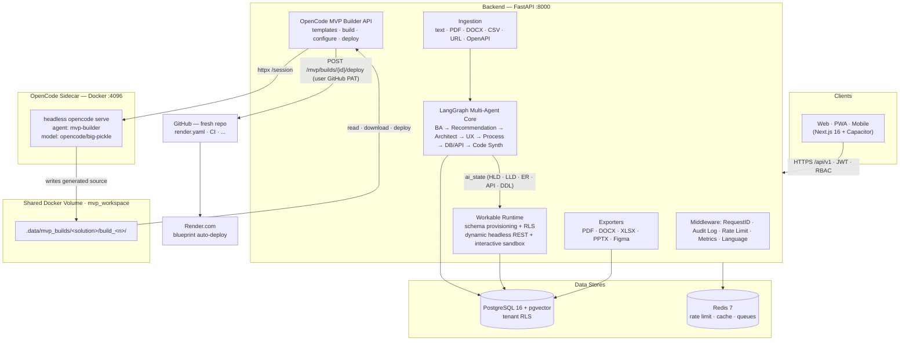

# AI Solution Builder

> **From Business Intent to Mounted, Production-Ready Software Systems in Minutes.**

[](https://github.com/mananjp/AI_Solution_Builder/actions)
[](https://www.python.org/)
[](https://fastapi.tiangolo.com/)
[](https://nextjs.org/)
[](https://www.postgresql.org/)
[](https://www.docker.com/)

---

## 🌟 Executive Overview

**AI Solution Builder** is an enterprise-grade AI system that converts business ideas, BRDs, SOPs, and legacy schemas into fully functional, tenant-isolated software applications alongside traditional architecture blueprints.

Unlike tools that merely produce mockups or static documentation, AI Solution Builder automatically provisions **live PostgreSQL database schemas**, generates **headless REST APIs**, mounts **interactive UI sandboxes**, and exports production codebases, Terraform scripts, and CI/CD pipelines.

---

## 🏗 System Architecture



### Container layout (`docker-compose.yml`)

| Service | Port | Role |
|---|---|---|
| `postgres` | `5433→5432` | pgvector/PostgreSQL 16, tenant RLS, AI + build metadata |
| `redis` | `6379` | rate limiting, caching, queues |
| `backend` | `8000` | FastAPI app (all `/api/v1` routes) |
| `opencode` | `4096` | headless OpenCode agent sidecar; mounts `mvp_workspace` |

The backend and the OpenCode sidecar share the `mvp_workspace` Docker volume: the sidecar writes generated source there (`/workspace/<solution_id>/build_<n>/`), and the backend reads it directly from `.data/mvp_builds/` — no network hop between generation and download/deploy.

---

## 🚀 Key Architecture & Capabilities

### 1. Multi-Agent Intelligence Core (LangGraph)
- **Business Analyst Agent**: Performs domain discovery, gap analysis, stakeholder mapping, and digital maturity assessment.
- **Business Recommendation Agent**: Recommends curated architectural modules from an extensible Industry Template Library when requirements are open-ended.
- **Solutions Architect Agent**: Formulates High-Level (HLD) and Low-Level (LLD) designs, infrastructure specs, and cloud topologies.
- **Process Intelligence Agent**: Generates executable BPMN 2.0 workflows with decision gates and bottleneck detection.
- **UX Agent**: Designs navigation flows, information architectures, and responsive screen wireframes.
- **Database & API Agent**: Formulates normalized relational schemas, ER diagrams, and OpenAPI 3.1 specifications.
- **Full-Stack Code Synthesizer**: Generates operational schemas, CRUD endpoints, and live UI components.

### 2. Workable System Runtime Engine
- **Tenant-Isolated PostgreSQL Schemas**: Declarative schemas applied per workspace solution with dynamic RLS isolation.
- **Instant Headless REST Engine**: Generic FastAPI dynamic router (`/api/v1/workable/{workspace_id}/{module_name}/...`) validating models on the fly.
- **Live Interactive Sandbox**: Interactive UI components rendering real-time forms, filters, and data grids.
- **Synthetic Data Generator**: Auto-populates tenant databases with realistic, localized dummy records.

### 3. Universal Input Ingestion
- Ingests raw text, PRDs, BRDs, PDFs (`PyMuPDF`), Word documents (`python-docx`), CSV/Excel schemas (`openpyxl`/`pandas`), OpenAPI specs (JSON/YAML, auto-detected), and website URLs (`httpx` + BeautifulSoup).
- Every format is normalized to readable text and injected into the agent pipeline as `uploaded_context` via `POST /api/v1/upload/document` and `POST /api/v1/upload/url`.
- *Planned:* vectorized semantic retrieval. The `context_chunks` table reserves a pgvector `embedding` column (`all-MiniLM-L6-v2`, dim 384), but nothing populates it yet — content reaches agents as plain text today.

### 4. Enterprise Governance & Admin
- **Credit & Plan Metering**: Granular credit deductions for generation, regeneration, and exports across Free, Pro, and Enterprise tiers.
- **Granular RBAC**: JWT authentication with roles (`admin`, `member`, `guest`).
- **Audit Logging & Metrics**: Real-time Prometheus metrics (`/metrics`), token consumption tracking, and system health checks.

### 5. Multi-Format Export Engine
- One-click export to **PDF**, **DOCX**, **XLSX**, and **PPTX**.
- Production code packaging with Dockerfiles, GitHub Actions CI workflows, and Terraform scaffolding.
- Direct **Figma REST API** export format for UX assets.
- **One-Click Deployer** targeting GitHub repositories.

### 6. Cross-Platform Delivery
- Web application (Next.js 16 App Router + Tailwind CSS).
- Installable PWA with service worker offline caching.
- Capacitor wrapper for Android (`@capacitor/android`) and iOS distribution.

### 7. OpenCode MVP Builder
- **Template presets**: `todo`, `calculator`, `portfolio` — small, deployable starters listed by `GET /api/v1/mvp/templates`.
- **Custom builds**: generates a full functional app from any validated solution's artifacts (HLD, LLD, ER, API spec, DDL, wireframes).
- **OpenCode sidecar**: a headless `opencode serve` container whose `mvp-builder` agent (model `opencode/big-pickle` — free on OpenCode Zen) "slot-fills" a pre-scaffolded FastAPI + Next.js project with the artifact-specific models, schemas, routers, and pages.
- **GitHub deploy**: `POST /api/v1/mvp/builds/{id}/deploy` pushes the workspace (with `render.yaml`, Dockerfile, CI workflow remapped to the repo root) to a fresh GitHub repository using the user's saved PAT, ready for a Render blueprint auto-deploy.

---

## 🔄 End-to-End Workflow

From a raw business idea to a deployed, working web app in eight phases.

### Phase 0 — Account & credentials
1. Register / log in to get a JWT (`POST /api/v1/auth/register`, `POST /api/v1/auth/login`).
2. (Optional, needed only for Phase 7) Save a GitHub Personal Access Token on your profile:
   ```bash
   PATCH /api/v1/auth/me/settings        {"github_token": "ghp_…", "render_api_key": "…"}
   ```
   Tokens are stored per-user in `user.settings` and never returned by profile endpoints.

### Phase 1 — Ingestion
Feed the system any loose business material — raw text, PRD/BRD, PDF, DOCX, CSV/Excel schema, OpenAPI spec, or a website URL. The ingestion layer parses every format into readable text and feeds it to the agents as `uploaded_context`, so every phase works from the same source material. (Vectorized semantic retrieval over `pgvector` is planned but not yet wired up.)

Ingest via the workspace UI (file dropzone or "paste a URL"), or directly:
- `POST /api/v1/upload/document` (multipart `file`) — PDF, DOCX, CSV/XLSX, TXT/MD, and OpenAPI JSON/YAML (auto-detected)
- `POST /api/v1/upload/url` (`{"url": "https://…"}`) — fetches a page and extracts readable text

### Phase 2 — Agentic design
A `POST` to the solutions/chat API runs the **LangGraph multi-agent pipeline**. Each node writes into the shared `ai_state`:

| Agent | Produces |
|---|---|
| Business Analyst | domain discovery, gap analysis, stakeholders |
| Business Recommendation | module suggestions from the industry template library |
| Solutions Architect | HLD + LLD, infrastructure spec |
| Process Intelligence | executable BPMN 2.0 workflows |
| UX | navigation flows + responsive screen wireframes |
| Database & API | normalized relational schema, ER diagram, DDL, OpenAPI 3.1 |
| Full-Stack Code Synthesizer | operational schemas, CRUD endpoints, live UI components |

### Phase 3 — Workable system runtime
For every **confirmed module**, the runtime provisions a tenant-isolated PostgreSQL schema (Row-Level Security), mounts a generic headless REST engine at `/api/v1/workable/{workspace_id}/{module_name}/…` that validates against those models on the fly, and seeds synthetic data.

### Phase 4 — Artifacts & export
All design artifacts become downloadable deliverables — **PDF / DOCX / XLSX / PPTX**, Figma-ready UX bundles, and full code/ infra packaging with Dockerfiles, GitHub Actions, and Terraform scaffolding.

### Phase 5 — Build an MVP
Two ways to start a functional build:
- **Template** — pick a small starter (`GET /api/v1/mvp/templates` → `todo` / `calculator` / `portfolio`) and pass `{"template": "todo", "app_name": "…"}`.
- **Custom** — let the full `ai_state` (from Phase 2) drive the build for an open-ended request.

Either way you call:
```bash
POST /api/v1/mvp/{solution_id}/build    # deducts MVP-build credits, runs async
GET  /api/v1/mvp/{solution_id}/builds   # poll build list
GET  /api/v1/mvp/builds/{id}/status     # status + generated file tree
```

### Phase 6 — What happens inside a build
1. The backend **scaffolds** a complete FastAPI + Next.js + infra project into the shared volume (`scaffold_build` substitutes app name / slug / title).
2. It compiles a **compact "slot-fill" prompt** from the HLD, LLD, ER entities, API endpoints, wireframe screens, and DDL — deliberately small so it fits the model's token limits.
3. The **OpenCode sidecar agent** (`opencode/big-pickle`) edits only these slots: `models.py`, `schemas.py`, `routers.py`, Alembic migration, and one CRUD page per module.
4. You can **download** the project as a ZIP (`GET …/download`) or **tune it** before shipping via a config overlay (`POST …/configure` with env values / app name).

### Phase 7 — One-click deploy to GitHub + Render
```bash
POST /api/v1/mvp/builds/{id}/deploy     {"repo_name": "quick-todos", "description": "…", "private": false}
```
- The workspace is flattened to a repo file map, with `infra/render.yaml`, `infra/docker-compose.yml`, and `infra/.github/**` remapped to the repository root.
- The deployer creates a fresh GitHub repo via the GitHub REST API using **your** saved PAT and pushes all files (`repo_url` is stored on the build; redeploys require `force: true`).
- Because the repo ships a **Render blueprint + CI workflow**, connecting the repo to Render auto-deploys the app on green CI.

### Phase 8 — Operate
Prometheus metrics (`/metrics`), health/ready probes, audit logs, and credit metering track usage across all tenants.

---

## 🗺 MVP Builder API Summary

| Method | Endpoint | Purpose |
|---|---|---|
| `GET` | `/api/v1/mvp/templates` | List deployable starter templates |
| `POST` | `/api/v1/mvp/{solution_id}/build` | Start an async build (template or custom) |
| `GET` | `/api/v1/mvp/{solution_id}/builds` | List builds for a solution |
| `GET` | `/api/v1/mvp/builds/{id}/status` | Status + generated file tree |
| `GET` | `/api/v1/mvp/builds/{id}/download` | Download the project as ZIP |
| `POST` | `/api/v1/mvp/builds/{id}/deploy` | Push to a fresh GitHub repo (Render-ready) |
| `POST` | `/api/v1/mvp/builds/{id}/configure` | Apply env/app-name config overlay |
| `DELETE` | `/api/v1/mvp/builds/{id}` | Cancel / destroy a build |
| `PATCH` | `/api/v1/auth/me/settings` | Save GitHub token / Render API key |

---

## 🛠 Tech Stack

| Layer | Technologies |
|---|---|
| **Backend** | Python 3.12, FastAPI, SQLAlchemy 2.0 (Async), Pydantic v2, LangGraph, LangChain, pgvector, Redis, PyMuPDF, python-docx, python-pptx, openpyxl/pandas, beautifulsoup4, PyYAML |
| **Frontend** | Next.js 16 (App Router, Turbopack), React 19, TypeScript 5, Tailwind CSS v4, `@xyflow/react`, Lucide Icons |
| **Mobile & PWA** | Capacitor 8 (Android/iOS shell), PWA Service Worker |
| **MVP Builder** | OpenCode headless sidecar (`opencode serve`), agent `mvp-builder` on model `opencode/big-pickle` (OpenCode Zen, free), HTTP proxy client (`httpx`) |
| **Data & Cache** | PostgreSQL 16 with `vector` extension, Redis 7 |
| **DevOps & Tooling**| Docker & Docker Compose, GitHub Actions, Ruff, Mypy, Pytest (Asyncio + Coverage), ESLint |

---

## 📁 Repository Structure

```
AI_Solution_Builder/
├── .github/
│   └── workflows/
│       └── ci.yml                    # Automated CI: lint, typecheck, test, build
├── backend/
│   ├── app/
│   │   ├── agents/                   # LangGraph state machine & multi-agent nodes
│   │   ├── api/                      # FastAPI route handlers
│   │   │   ├── auth.py               #   login / register / user settings
│   │   │   ├── mvp.py                #   MVP build, download, deploy, configure
│   │   │   ├── workable.py           #   dynamic runtime schema + REST engine
│   │   │   └── ...
│   │   ├── core/                     # Config, database, redis, security, credits
│   │   ├── ingestion/                # Universal parser (PDF, DOCX, CSV/Excel, OpenAPI, URLs)
│   │   ├── models/                   # SQLAlchemy ORM models
│   │   │   ├── mvp_build.py          #   MVPBuild (status, workspace_path, repo_url)
│   │   │   ├── solution.py
│   │   │   ├── user.py               #   includes settings JSONB for deploy creds
│   │   │   └── ...
│   │   ├── schemas/                  # Pydantic validation schemas (incl. MVP*)
│   │   ├── services/
│   │   │   ├── deployer.py           # GitHub REST API repo creation + file push
│   │   │   ├── mvp_builder.py        # OpenCode sidecar proxy, prompt builder, scaffold
│   │   │   ├── templates.py          # Starter template presets (todo/calculator/portfolio)
│   │   │   ├── synthetic.py          # Synthetic data generator
│   │   │   └── exporters.py          # PDF / DOCX / XLSX / PPTX / Figma exporters
│   │   └── workable/                 # Dynamic schema provisioner & runtime engine
│   ├── opencode/                     # OpenCode sidecar — built into Docker image
│   │   ├── Dockerfile
│   │   ├── config.json               # model: opencode/big-pickle
│   │   ├── agents/
│   │   │   └── mvp-builder.md        # Agent instructions (slot-fill workflow)
│   │   └── templates/mvp/            # Pre-scaffolded MVP project base
│   │       ├── backend/              #   FastAPI boilerplate + Alembic + auth
│   │       ├── frontend/             #   Next.js 16 boilerplate + Tailwind
│   │       └── infra/                #   render.yaml, docker-compose, CI, README
│   ├── scripts/
│   │   └── seed_demo.py              # Seeds demo user/org/workspace (dev convenience)
│   ├── tests/                        # 150+ async tests (pytest + coverage ≥ 80%)
│   ├── Dockerfile
│   ├── pyproject.toml
│   └── requirements.txt
├── frontend/
│   ├── src/
│   │   ├── app/                      # Next.js App Router (auth, dashboard, chat, …)
│   │   ├── components/               # BPMN viewer, Sandpack, wireframe viewer, …
│   │   └── lib/                      # API client, auth helpers, utilities
│   ├── android/                      # Capacitor Android native project
│   ├── capacitor.config.ts
│   └── package.json
├── docker-compose.yml                # postgres · redis · backend · opencode
├── .env.example                      # Environment configuration template
└── README.md
```

---

## 🚀 Quick Start

### Prerequisites
- [Docker](https://www.docker.com/) & Docker Compose
- [Node.js 20+](https://nodejs.org/) & `npm`
- [Python 3.12+](https://www.python.org/)

### 1. Clone & Configure
```bash
git clone https://github.com/mananjp/AI_Solution_Builder.git
cd AI_Solution_Builder

# Copy environment template
cp .env.example .env
# Edit .env with your LLM API keys (Groq or OpenAI). For the MVP builder,
# OPENCODE_MODEL=opencode/big-pickle is used by the sidecar's own config.json
# (free via OpenCode Zen) — no extra key needed.
```

### 2. Run with Docker Compose
```bash
docker compose up --build
```
- Frontend: `http://localhost:3000`
- Backend API: `http://localhost:8000`
- Interactive API Docs: `http://localhost:8000/docs`
- OpenCode sidecar health: `http://localhost:4096/global/health` (`{"healthy":true}`)

This starts five cooperating services: `frontend` (Next.js standalone), `postgres`
(pgvector), `redis`, `backend`, and the `opencode` sidecar (which shares the
`mvp_workspace` volume with the backend so generated code is visible to the API
instantly).

> **Production guard:** the backend image boots as `APP_ENV=production` and refuses
> to start unless `JWT_SECRET_KEY` is a strong, unique secret (≥ 32 chars). Set one
> in your `.env` before `docker compose up` — the placeholder in `.env.example` will
> fail fast with a clear message. On boot it also runs `alembic upgrade head`
> automatically, so schema migrations apply before the server accepts traffic.

### 3. (Optional) Seed a demo account
```bash
cd backend
python scripts/seed_demo.py
# demo@aibuilder.example / DemoPass123!  — a Free-plan demo org + workspace
```

### 4. Try an MVP build end-to-end
1. Log in and create a workspace/solution, then generate its artifacts (Phases 1–3).
2. `GET /api/v1/mvp/templates` → pick a template (`todo`, `calculator`, `portfolio`).
3. `POST /api/v1/mvp/{solution_id}/build` with `{"template": "todo", "app_name": "…"}`.
4. Poll `GET /api/v1/mvp/builds/{id}/status` until `complete`, then download the ZIP.
5. To deploy: `PATCH /api/v1/auth/me/settings` with a **GitHub PAT**, then
   `POST /api/v1/mvp/builds/{id}/deploy` → connect the repo to Render.

---

## 🌐 Deployment

The repo is deployable today as a **single instance** and has Phase-0 pre-flight
hardening built in:

- **JWT secret guard** — the backend refuses to boot when `APP_ENV=production`
  unless `JWT_SECRET_KEY` is unique and ≥ 32 chars (see `backend/app/core/config.py`).
- **Migrations on boot** — the backend image runs `alembic upgrade head` before
  starting uvicorn (`backend/docker-entrypoint.sh`).
- **Frontend image** — `frontend/Dockerfile` builds a standalone Next.js output
  (`next.config.ts` has `output: "standalone"`); pass the backend URL at build time:
  `docker build -f frontend/Dockerfile --build-arg NEXT_PUBLIC_API_URL=https://api.example.com/api/v1 .`
- **Health checks** — `/health`, `/ready`, `/metrics` on the backend; the compose
  healthchecks gate frontend → backend → postgres/redis/opencode startup ordering.

Recommended production topology (Phase 1+):

1. Backend + `opencode` sidecar + Postgres (pgvector) + Redis on one host
   (Render or Fly.io). Backend and `opencode` must be co-located — they share the
   `mvp_workspace` volume, so a single replica is required for MVP file sharing.
2. Frontend on Vercel (zero-config) or the `frontend/` Docker image.
3. Set per environment: `DATABASE_URL`, `REDIS_URL`, `GROQ_API_KEY`,
   `GROQ_MODEL_NAME` (pinned), `JWT_SECRET_KEY`, `CORS_ORIGINS`, `OPENCODE_SERVER_URL`.
   GitHub PATs are per-user credentials stored in the app.

Open work: a root deploy manifest (`render.yaml`/`fly.toml`), a shared/networked
volume if you ever run > 1 backend replica, and a CI/CD deploy step
(`/health`-gated). These are deliberately left for the infra provider choice.

---

## 🧪 Development & Testing

### Backend
```bash
cd backend
python -m venv .venv
source .venv/bin/activate  # Or `.venv\Scripts\activate` on Windows
pip install -r requirements-dev.txt

# Run linting and formatting
ruff check .
ruff format --check .

# Run type checker
mypy app/

# Run complete test suite with coverage
pytest
```

### Frontend
```bash
cd frontend
npm install

# Run linter
npm run lint

# Build production bundle
npm run build

# Start dev server
npm run dev
```

---

## 🛡 Security & License
- Enterprise Row-Level Security (RLS) policies.
- Secure environment separation with `.env.example`.
- Distributed under the MIT License.
