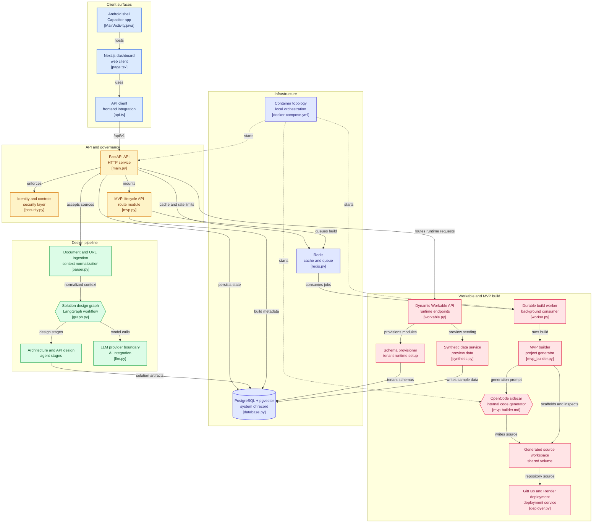

# AI Solution Builder

> **From Business Intent to Mounted, Production-Ready Software Systems in Minutes.**

[](https://github.com/mananjp/AI_Solution_Builder/actions)
[](https://github.com/mananjp/AI_Solution_Builder/pkgs/container/ai-solution-builder-app)
[](https://www.python.org/)
[](https://fastapi.tiangolo.com/)
[](https://nextjs.org/)
[](https://www.postgresql.org/)
[](https://www.docker.com/)
[](LICENSE)

---

## 🌟 Executive Overview

**AI Solution Builder** is an enterprise-grade AI system that converts business ideas, BRDs, SOPs, and legacy schemas into fully functional, tenant-isolated software applications alongside traditional architecture blueprints.

Unlike tools that merely produce mockups or static documentation, AI Solution Builder automatically provisions **live PostgreSQL database schemas**, generates **headless REST APIs**, mounts **interactive UI sandboxes**, and exports production codebases, Terraform scripts, and CI/CD pipelines.

---

## 🏗 System Architecture


```mermaid
flowchart TD

subgraph group_client["Client surfaces"]
  node_web["Next.js dashboard<br/>web client<br/>[page.tsx]"]
  node_api_client["API client<br/>frontend integration<br/>[api.ts]"]
  node_android["Android shell<br/>Capacitor app<br/>[MainActivity.java]"]
end

subgraph group_api["API and governance"]
  node_fastapi["FastAPI API<br/>HTTP service<br/>[main.py]"]
  node_identity["Identity and controls<br/>security layer<br/>[security.py]"]
  node_mvp_api["MVP lifecycle API<br/>route module<br/>[mvp.py]"]
end

subgraph group_design["Design pipeline"]
  node_ingestion["Document and URL ingestion<br/>context normalization<br/>[parser.py]"]
  node_agent_graph{{"Solution design graph<br/>LangGraph workflow<br/>[graph.py]"}}
  node_architecture["Architecture and API design<br/>agent stages"]
  node_llm["LLM provider boundary<br/>AI integration<br/>[llm.py]"]
end

subgraph group_runtime["Workable and MVP build"]
  node_workable_api["Dynamic Workable API<br/>runtime endpoints<br/>[workable.py]"]
  node_provisioner["Schema provisioner<br/>tenant runtime setup"]
  node_synthetic_data["Synthetic data service<br/>preview data<br/>[synthetic.py]"]
  node_worker["Durable build worker<br/>background consumer<br/>[worker.py]"]
  node_mvp_builder["MVP builder<br/>project generator<br/>[mvp_builder.py]"]
  node_opencode{{"OpenCode sidecar<br/>internal code generator<br/>[mvp-builder.md]"}}
  node_workspace["Generated source workspace<br/>shared volume"]
  node_deployment["GitHub and Render deployment<br/>deployment service<br/>[deployer.py]"]
end

subgraph group_infra["Infrastructure"]
  node_postgres[("PostgreSQL + pgvector<br/>system of record<br/>[database.py]")]
  node_redis["Redis<br/>cache and queue<br/>[redis.py]"]
  node_compose["Container topology<br/>local orchestration<br/>[docker-compose.yml]"]
end

node_web -->|"uses"| node_api_client
node_android -->|"hosts"| node_web
node_api_client -->|"/api/v1"| node_fastapi
node_fastapi -->|"enforces"| node_identity
node_fastapi -->|"persists state"| node_postgres
node_fastapi -->|"cache and rate limits"| node_redis
node_fastapi -->|"accepts sources"| node_ingestion
node_ingestion -->|"normalized context"| node_agent_graph
node_agent_graph -->|"design stages"| node_architecture
node_agent_graph -->|"model calls"| node_llm
node_architecture -->|"solution artifacts"| node_postgres
node_fastapi -->|"routes runtime requests"| node_workable_api
node_workable_api -->|"provisions modules"| node_provisioner
node_provisioner -->|"tenant schemas"| node_postgres
node_workable_api -->|"preview seeding"| node_synthetic_data
node_synthetic_data -->|"writes sample data"| node_postgres
node_fastapi -->|"mounts"| node_mvp_api
node_mvp_api -->|"build metadata"| node_postgres
node_mvp_api -->|"queues build"| node_redis
node_redis -->|"consumes jobs"| node_worker
node_worker -->|"runs build"| node_mvp_builder
node_mvp_builder -->|"generation prompt"| node_opencode
node_opencode -->|"writes source"| node_workspace
node_mvp_builder -->|"scaffolds and inspects"| node_workspace
node_workspace -->|"repository source"| node_deployment
node_compose -.->|"starts"| node_fastapi
node_compose -.->|"starts"| node_worker
node_compose -.->|"starts"| node_opencode

click node_web "https://github.com/mananjp/ai_solution_builder/blob/main/frontend/src/app/(dashboard)/solution/%5Bid%5D/page.tsx"
click node_api_client "https://github.com/mananjp/ai_solution_builder/blob/main/frontend/src/lib/api.ts"
click node_android "https://github.com/mananjp/ai_solution_builder/blob/main/frontend/android/app/src/main/java/com/futurrizon/aisolutionbuilder/MainActivity.java"
click node_fastapi "https://github.com/mananjp/ai_solution_builder/blob/main/backend/main.py"
click node_identity "https://github.com/mananjp/ai_solution_builder/blob/main/backend/app/core/security.py"
click node_mvp_api "https://github.com/mananjp/ai_solution_builder/blob/main/backend/app/api/mvp.py"
click node_postgres "https://github.com/mananjp/ai_solution_builder/blob/main/backend/app/core/database.py"
click node_redis "https://github.com/mananjp/ai_solution_builder/blob/main/backend/app/core/redis.py"
click node_ingestion "https://github.com/mananjp/ai_solution_builder/blob/main/backend/app/ingestion/parser.py"
click node_agent_graph "https://github.com/mananjp/ai_solution_builder/blob/main/backend/app/agents/graph.py"
click node_architecture "https://github.com/mananjp/ai_solution_builder/blob/main/backend/app/agents/nodes/database_api_agent.py"
click node_llm "https://github.com/mananjp/ai_solution_builder/blob/main/backend/app/core/llm.py"
click node_workable_api "https://github.com/mananjp/ai_solution_builder/blob/main/backend/app/api/workable.py"
click node_provisioner "https://github.com/mananjp/ai_solution_builder/blob/main/backend/app/workable/schema_provisioner.py"
click node_synthetic_data "https://github.com/mananjp/ai_solution_builder/blob/main/backend/app/services/synthetic.py"
click node_worker "https://github.com/mananjp/ai_solution_builder/blob/main/backend/app/worker.py"
click node_mvp_builder "https://github.com/mananjp/ai_solution_builder/blob/main/backend/app/services/mvp_builder.py"
click node_opencode "https://github.com/mananjp/ai_solution_builder/blob/main/backend/opencode/agents/mvp-builder.md"
click node_deployment "https://github.com/mananjp/ai_solution_builder/blob/main/backend/app/services/deployer.py"
click node_compose "https://github.com/mananjp/ai_solution_builder/blob/main/docker-compose.yml"

classDef toneNeutral fill:#f8fafc,stroke:#334155,stroke-width:1.5px,color:#0f172a
classDef toneBlue fill:#dbeafe,stroke:#2563eb,stroke-width:1.5px,color:#172554
classDef toneAmber fill:#fef3c7,stroke:#d97706,stroke-width:1.5px,color:#78350f
classDef toneMint fill:#dcfce7,stroke:#16a34a,stroke-width:1.5px,color:#14532d
classDef toneRose fill:#ffe4e6,stroke:#e11d48,stroke-width:1.5px,color:#881337
classDef toneIndigo fill:#e0e7ff,stroke:#4f46e5,stroke-width:1.5px,color:#312e81
classDef toneTeal fill:#ccfbf1,stroke:#0f766e,stroke-width:1.5px,color:#134e4a
class node_web,node_api_client,node_android toneBlue
class node_fastapi,node_identity,node_mvp_api toneAmber
class node_ingestion,node_agent_graph,node_architecture,node_llm toneMint
class node_workable_api,node_provisioner,node_synthetic_data,node_worker,node_mvp_builder,node_opencode,node_workspace,node_deployment toneRose
class node_postgres,node_redis,node_compose toneIndigo
```


### Container layout (`docker-compose.yml`)

| Service | Port | Role |
|---|---|---|
| `postgres` | `5433→5432` | pgvector/PostgreSQL 16, tenant RLS, AI + build metadata |
| `redis` | `6379` | rate limiting, caching, queues |
| `backend` | `8000` | FastAPI app (all `/api/v1` routes) |
| `opencode` | `4096` | headless OpenCode agent sidecar; mounts `mvp_workspace` |

The backend and the OpenCode sidecar share the `mvp_workspace` Docker volume: the sidecar writes generated source there (`/workspace/<solution_id>/build_<n>/`), and the backend reads it directly from `.data/mvp_builds/` — no network hop between generation and download/deploy.

---

## 🚀 Key Architecture & Capabilities

### 1. Multi-Agent Intelligence Core (LangGraph)
- **Business Analyst Agent**: Performs domain discovery, gap analysis, stakeholder mapping, and digital maturity assessment.
- **Business Recommendation Agent**: Recommends curated architectural modules from an extensible Industry Template Library when requirements are open-ended.
- **Solutions Architect Agent**: Formulates High-Level (HLD) and Low-Level (LLD) designs, infrastructure specs, and cloud topologies.
- **Process Intelligence Agent**: Generates executable BPMN 2.0 workflows with decision gates and bottleneck detection.
- **UX Agent**: Designs navigation flows, information architectures, and responsive screen wireframes.
- **Database & API Agent**: Formulates normalized relational schemas, ER diagrams, and OpenAPI 3.1 specifications.
- **Full-Stack Code Synthesizer**: Generates operational schemas, CRUD endpoints, and live UI components.

### 2. Workable System Runtime Engine
- **Tenant-Isolated PostgreSQL Schemas**: Declarative schemas applied per workspace solution with dynamic RLS isolation.
- **Instant Headless REST Engine**: Generic FastAPI dynamic router (`/api/v1/workable/{workspace_id}/{module_name}/...`) validating models on the fly.
- **Live Interactive Sandbox**: Interactive UI components rendering real-time forms, filters, and data grids.
- **Synthetic Data Generator**: Auto-populates tenant databases with realistic, localized dummy records.

### 3. Universal Input Ingestion
- Ingests raw text, PRDs, BRDs, PDFs (`PyMuPDF`), Word documents (`python-docx`), CSV/Excel schemas (`openpyxl`/`pandas`), OpenAPI specs (JSON/YAML, auto-detected), and website URLs (`httpx` + BeautifulSoup).
- Every format is normalized to readable text and injected into the agent pipeline as `uploaded_context` via `POST /api/v1/upload/document` and `POST /api/v1/upload/url`.
- *Planned:* vectorized semantic retrieval. The `context_chunks` table reserves a pgvector `embedding` column (`all-MiniLM-L6-v2`, dim 384), but nothing populates it yet — content reaches agents as plain text today.

### 4. Enterprise Governance & Admin
- **Credit & Plan Metering**: Granular credit deductions for generation, regeneration, and exports across Free, Pro, and Enterprise tiers.
- **Granular RBAC**: JWT authentication with roles (`admin`, `member`, `guest`).
- **Audit Logging & Metrics**: Real-time Prometheus metrics (`/metrics`), token consumption tracking, and system health checks.

### 5. Multi-Format Export Engine
- One-click export to **PDF**, **DOCX**, **XLSX**, and **PPTX**.
- Production code packaging with Dockerfiles, GitHub Actions CI workflows, and Terraform scaffolding.
- Direct **Figma REST API** export format for UX assets.
- **One-Click Deployer** targeting GitHub repositories.

### 6. Cross-Platform Delivery
- Web application (Next.js 16 App Router + Tailwind CSS).
- Installable PWA with service worker offline caching.
- Capacitor wrapper for Android (`@capacitor/android`) and web application / PWA distribution.

### 7. Unified Build Orchestrator & AppSpec v2
- **Unified Build Orchestrator (`build_orchestrator.py`)**: A centralized 9-stage pipeline (`BuildContext`, `run_build_pipeline`) powering both the OpenCode sidecar and integrated synthesizer with AST verification and self-healing.
- **Dynamic AppSpec v2**: Replaces static templates with rich domain models (`app_kind`, `lifecycle_stage`, `data_layer`, `theme`, `analytics`, `seed_data`). Every app is generated bespoke from business intent rather than copy-pasted boilerplate.
- **Domain Theming Engine (`theme_engine.py`)**: Automatically classifies the business vertical across 8 curated industry palettes (e.g. food/beverage, fintech, healthcare, SaaS) and enforces WCAG-compliant accessible contrast ratios.
- **Non-Destructive Codegen**: Preserves developer modifications using `// @generated by AI Solution Builder` markers, generating safe `page.generated.tsx` sidecars and `plan_schema_delta` migrations on re-builds.
- **Opt-In Analytics**: Decoupled from core system locked files; `routers_analytics.py` and `recharts` dependencies are included only when explicitly enabled.
- **Autonomous Asset Sourcing (`asset_sourcing.py`)**: Queries Wikimedia Commons, Openverse, and high-res photo repositories for authentic domain images and emits compliant `CREDITS.json` files.
- **Proactive Requirement Clarification (`clarification.py` & `ClarificationPanel.tsx`)**: Detects ambiguous gaps in user prompts via SSE streaming and interactive UI choices before code generation begins.
- **Quality Gate (`verify_mvp_quality`)**: Verifies code validity, route completeness, and seed data integrity before packaging.
- **GitHub deploy**: `POST /api/v1/mvp/builds/{id}/deploy` pushes the workspace (with `render.yaml`, Dockerfile, CI workflow remapped to the repo root) to a fresh GitHub repository using the user's saved PAT, ready for a Render blueprint auto-deploy.

### 7a. Running & fixing the sidecar
The sidecar is a headless `opencode serve` server on `:4096`. Local dev:
```bash
# From the repo root — put OPENCODE_ZEN_API_KEY in .env first (free at
# https://opencode.ai/zen); the default model is opencode/big-pickle
docker compose up -d opencode
make -C backend sidecar-logs      # tail [opencode] logs
curl http://localhost:4096/api/info   # or /global/health (older builds)
```
No Zen key? Set `OPENCODE_MODEL=groq/openai/gpt-oss-120b` in `.env` and the sidecar uses your existing `GROQ_API_KEY` instead — no other change needed.
When in doubt, hit `/api/v1/opencode/diagnose` (authenticated) — it checks reachability,
the LLM key, and runs a live generation round-trip, returning a copy-paste fix for
each failing check. The dashboard's status chip shows the sidecar state + active model.

**Parallel builds (multiple users/sessions at once).** Each build/session is
deterministically hashed onto an `opencode` instance from the pool instead of
serializing everything through one container. To run a pool:
```bash
# docker-compose: scale replicas; each becomes opencode-N on the internal network
docker compose up --scale opencode=3 -d
# Point the backend at the whole pool (comma-separated) — see .env.example
# OPENCODE_POOL_URLS=http://opencode-1:4096,http://opencode-2:4096,http://opencode-3:4096
```
Sessions pin to whichever pool member they started on, so a conversation keeps
its full context (files + chat) until it finishes. Keep `OPENCODE_POOL_URLS`
unset to use the single `OPENCODE_SERVER_URL` instance.

**Observable builds & deploys.** The Build Card shows a live 5-stage stepper
(synthesize → scaffold → generate → verify → package) with per-stage status and
an exact percentage, instead of a stuck placeholder; the chat streams the same
milestones. `/api/v1/system/resources` (rendered on the dashboard and build
cards) returns real CPU / memory / disk of the build host every few seconds.
Deploys are staged — backend first, then frontend with `NEXT_PUBLIC_API_URL`
auto-injected — and `/api/v1/mvp/builds/{id}/deploy/status` polls Render's
actual deploy objects, so the UI only ever says "live" when the deployment is
actually live. Required env vars are surfaced in the Deploy modal with an
"auto-injected" tag for service-to-service URLs the agent already knows.

---

## 🔄 End-to-End Workflow

From a raw business idea to a deployed, working web app in eight phases.

### Phase 0 — Account & credentials
1. Register / log in to get a JWT (`POST /api/v1/auth/register`, `POST /api/v1/auth/login`).
2. (Optional, needed only for Phase 7) Save a GitHub Personal Access Token on your profile:
   ```bash
   PATCH /api/v1/auth/me/settings        {"github_token": "ghp_…", "render_api_key": "…"}
   ```
   Tokens are stored per-user in `user.settings` and never returned by profile endpoints.

### Phase 1 — Ingestion
Feed the system any loose business material — raw text, PRD/BRD, PDF, DOCX, CSV/Excel schema, OpenAPI spec, or a website URL. The ingestion layer parses every format into readable text and feeds it to the agents as `uploaded_context`, so every phase works from the same source material. (Vectorized semantic retrieval over `pgvector` is planned but not yet wired up.)

Ingest via the workspace UI (file dropzone or "paste a URL"), or directly:
- `POST /api/v1/upload/document` (multipart `file`) — PDF, DOCX, CSV/XLSX, TXT/MD, and OpenAPI JSON/YAML (auto-detected)
- `POST /api/v1/upload/url` (`{"url": "https://…"}`) — fetches a page and extracts readable text

### Phase 2 — Agentic design
A `POST` to the solutions/chat API runs the **LangGraph multi-agent pipeline**. Each node writes into the shared `ai_state`:

| Agent | Produces |
|---|---|
| Business Analyst | domain discovery, gap analysis, stakeholders |
| Business Recommendation | module suggestions from the industry template library |
| Solutions Architect | HLD + LLD, infrastructure spec |
| Process Intelligence | executable BPMN 2.0 workflows |
| UX | navigation flows + responsive screen wireframes |
| Database & API | normalized relational schema, ER diagram, DDL, OpenAPI 3.1 |
| Full-Stack Code Synthesizer | operational schemas, CRUD endpoints, live UI components |

### Phase 3 — Workable system runtime
For every **confirmed module**, the runtime provisions a tenant-isolated PostgreSQL schema (Row-Level Security), mounts a generic headless REST engine at `/api/v1/workable/{workspace_id}/{module_name}/…` that validates against those models on the fly, and seeds synthetic data.

### Phase 4 — Artifacts & export
All design artifacts become downloadable deliverables — **PDF / DOCX / XLSX / PPTX**, Figma-ready UX bundles, and full code/ infra packaging with Dockerfiles, GitHub Actions, and Terraform scaffolding.

### Phase 5 — Build an MVP
Two ways to start a functional build:
- **Template** — pick a small starter (`GET /api/v1/mvp/templates` → `todo` / `calculator` / `portfolio`) and pass `{"template": "todo", "app_name": "…"}`.
- **Custom** — let the full `ai_state` (from Phase 2) drive the build for an open-ended request.

Either way you call:
```bash
POST /api/v1/mvp/{solution_id}/build    # deducts MVP-build credits, runs async
GET  /api/v1/mvp/{solution_id}/builds   # poll build list
GET  /api/v1/mvp/builds/{id}/status     # status + generated file tree
```

### Phase 6 — What happens inside a build
1. The backend **scaffolds** a complete FastAPI + Next.js + infra project into the shared volume (`scaffold_build` substitutes app name / slug / title).
2. It compiles a **compact "slot-fill" prompt** from the HLD, LLD, ER entities, API endpoints, wireframe screens, and DDL — deliberately small so it fits the model's token limits.
3. The **OpenCode sidecar agent** (`mvp-builder`, default model `opencode/big-pickle` — free on OpenCode Zen) edits only these slots: `models.py`, `schemas.py`, `routers.py`, Alembic migration, and one CRUD page per module.
4. You can **download** the project as a ZIP (`GET …/download`) or **tune it** before shipping via a config overlay (`POST …/configure` with env values / app name).

### Phase 7 — One-click deploy to GitHub + Render
```bash
POST /api/v1/mvp/builds/{id}/deploy     {"repo_name": "quick-todos", "description": "…", "private": false}
```
- The workspace is flattened to a repo file map, with `infra/render.yaml`, `infra/docker-compose.yml`, and `infra/.github/**` remapped to the repository root.
- The deployer creates a fresh GitHub repo via the GitHub REST API using **your** saved PAT and pushes all files (`repo_url` is stored on the build; redeploys require `force: true`).
- Because the repo ships a **Render blueprint + CI workflow**, connecting the repo to Render auto-deploys the app on green CI.

### Phase 8 — Operate
Prometheus metrics (`/metrics`), health/ready probes, audit logs, and credit metering track usage across all tenants.

---

## 🗺 MVP Builder API Summary

| Method | Endpoint | Purpose |
|---|---|---|
| `GET` | `/api/v1/mvp/templates` | List deployable starter templates |
| `POST` | `/api/v1/mvp/{solution_id}/build` | Start an async build (template or custom) |
| `GET` | `/api/v1/mvp/{solution_id}/builds` | List builds for a solution |
| `GET` | `/api/v1/mvp/builds/{id}/status` | Status + generated file tree (live stepper progress) |
| `GET` | `/api/v1/mvp/builds/{id}/download` | Download the project as ZIP |
| `POST` | `/api/v1/mvp/builds/{id}/deploy` | Staged backend→frontend Render deploy (env-aware) |
| `GET` | `/api/v1/mvp/builds/{id}/deploy/status` | Poll real Render deploy objects (queued/building/live/failed) |
| `GET` | `/api/v1/mvp/builds/{id}/env-plan` | Required/optional env vars detected in the code |
| `POST` | `/api/v1/mvp/builds/{id}/sandbox/chat` | SSE live Q&A agent for the deployed preview |
| `POST` | `/api/v1/mvp/builds/{id}/configure` | Apply env/app-name config overlay |
| `POST` | `/api/v1/mvp/builds/{id}/preview/destroy` | Tear down Render preview services |
| `GET` | `/api/v1/mvp/{solution_id}/clarifications` | Inspect solution for architectural value gaps |
| `POST` | `/api/v1/opencode/chat/clarify` | Proactive prompt clarification probe |
| `GET` | `/api/v1/system/resources` | Live CPU / memory / disk of the build host |
| `DELETE` | `/api/v1/mvp/builds/{id}` | Cancel / destroy a build |
| `PATCH` | `/api/v1/auth/me/settings` | Save GitHub token / Render API key |

---

## 🛠 Tech Stack

| Layer | Technologies |
|---|---|
| **Backend** | Python 3.12, FastAPI, SQLAlchemy 2.0 (Async), Pydantic v2, LangGraph, LangChain, pgvector, Redis, PyMuPDF, python-docx, python-pptx, openpyxl/pandas, beautifulsoup4, PyYAML |
| **Frontend** | Next.js 16 (App Router, Turbopack), React 19, TypeScript 5, Tailwind CSS v4, `@xyflow/react`, Lucide Icons |
| **Mobile & PWA** | Capacitor 8 (Android shell; web app / PWA), PWA Service Worker |
| **MVP Builder** | OpenCode headless sidecar (`opencode serve`), agent `mvp-builder` on model `opencode/big-pickle` (free via OpenCode Zen; Groq fallback), HTTP proxy client (`httpx`) |
| **Data & Cache** | PostgreSQL 16 with `vector` extension, Redis 7 |
| **DevOps & CI/CD**| GitHub Actions (CI & GHCR publishing), Docker & Docker Compose, Dockle security scanning, Ruff, Mypy, Pytest (Coverage ≥ 80%), ESLint |

---

## 📁 Repository Structure

```
AI_Solution_Builder/
├── .github/
│   └── workflows/
│       └── ci.yml                    # Automated CI: lint, typecheck, test, build
├── backend/
│   ├── app/
│   │   ├── agents/                   # LangGraph state machine & multi-agent nodes
│   │   ├── api/                      # FastAPI route handlers
│   │   │   ├── auth.py               #   login / register / user settings
│   │   │   ├── mvp.py                #   MVP build, download, deploy, configure
│   │   │   ├── workable.py           #   dynamic runtime schema + REST engine
│   │   │   └── ...
│   │   ├── core/                     # Config, database, redis, security, credits
│   │   ├── ingestion/                # Universal parser (PDF, DOCX, CSV/Excel, OpenAPI, URLs)
│   │   ├── models/                   # SQLAlchemy ORM models
│   │   │   ├── mvp_build.py          #   MVPBuild (status, workspace_path, repo_url)
│   │   │   ├── solution.py
│   │   │   ├── user.py               #   includes settings JSONB for deploy creds
│   │   │   └── ...
│   │   ├── schemas/                  # Pydantic validation schemas (incl. MVP*)
│   │   ├── services/
│   │   │   ├── deployer.py           # GitHub REST API repo creation + file push
│   │   │   ├── mvp_builder.py        # OpenCode sidecar proxy, prompt builder, scaffold
│   │   │   ├── templates.py          # Starter template presets (todo/calculator/portfolio)
│   │   │   ├── synthetic.py          # Synthetic data generator
│   │   │   └── exporters.py          # PDF / DOCX / XLSX / PPTX / Figma exporters
│   │   └── workable/                 # Dynamic schema provisioner & runtime engine
│   ├── opencode/                     # OpenCode sidecar — built into Docker image
│   │   ├── Dockerfile
│   │   ├── config.json               # model: opencode/big-pickle (Zen)
│   │   ├── agents/
│   │   │   └── mvp-builder.md        # Agent instructions (slot-fill workflow)
│   │   └── templates/mvp/            # Pre-scaffolded MVP project base
│   │       ├── backend/              #   FastAPI boilerplate + Alembic + auth
│   │       ├── frontend/             #   Next.js 16 boilerplate + Tailwind
│   │       └── infra/                #   render.yaml, docker-compose, CI, README
│   ├── scripts/
│   │   └── seed_demo.py              # Seeds demo user/org/workspace (dev convenience)
│   ├── tests/                        # 150+ async tests (pytest + coverage ≥ 80%)
│   ├── Dockerfile
│   ├── pyproject.toml
│   └── requirements.txt
├── frontend/
│   ├── src/
│   │   ├── app/                      # Next.js App Router (auth, dashboard, chat, …)
│   │   ├── components/               # BPMN viewer, Sandpack, wireframe viewer, …
│   │   └── lib/                      # API client, auth helpers, utilities
│   ├── android/                      # Capacitor Android native project
│   ├── capacitor.config.ts
│   └── package.json
├── docker-compose.yml                # postgres · redis · backend · worker · opencode
├── .env.example                      # Environment configuration template
└── README.md
```

---

## 🚀 Quick Start

### Prerequisites
- [Docker](https://www.docker.com/) & Docker Compose
- [Node.js 20+](https://nodejs.org/) & `npm`
- [Python 3.12+](https://www.python.org/)

### 1. Clone & Configure
```bash
git clone https://github.com/mananjp/AI_Solution_Builder.git
cd AI_Solution_Builder

# Copy environment template
cp .env.example .env
# Edit .env with your LLM API keys (Groq or OpenAI).
# The OpenCode sidecar defaults to the free opencode/big-pickle model, which
# needs OPENCODE_ZEN_API_KEY (https://opencode.ai/zen). No Zen key? Set
# OPENCODE_MODEL=groq/openai/gpt-oss-120b and it uses your GROQ_API_KEY.
```

### 2. Run with Docker Compose
```bash
docker compose up --build
```
- Frontend: `http://localhost:3000`
- Backend API: `http://localhost:8000`
- Interactive API Docs: `http://localhost:8000/docs`
- OpenCode sidecar health: `http://localhost:4096/global/health` (`{"healthy":true}`)

This starts six cooperating services: `frontend` (Next.js standalone), `postgres`
(pgvector), `redis`, `backend`, `worker` (durable queue consumer), and the `opencode`
sidecar (which shares the `mvp_workspace` volume with the backend and worker so
generated code is visible instantly).

> **Worker Mode:** `WORKER_MODE=worker` (default) requires the `worker` container to be
> running to process queued builds. If running the backend locally outside Docker without
> the worker daemon, set `WORKER_MODE=inline` in your `.env` so builds execute directly.

> **Production guard:** with `APP_ENV=production`, the API requires Auth0 (`AUTH0_DOMAIN`,
> `AUTH0_AUDIENCE`) and `SECRET_ENCRYPTION_KEY`. Anonymous and dev bypass authentication
> are disabled. Database migration failures abort startup rather than serving against
> a stale schema.

### 3. Try an MVP build end-to-end
1. Log in and create a workspace/solution, then generate its artifacts (Phases 1–3).
2. `GET /api/v1/mvp/templates` → pick a template (`todo`, `calculator`, `portfolio`).
3. `POST /api/v1/mvp/{solution_id}/build` with `{"template": "todo", "app_name": "…"}`.
4. Poll `GET /api/v1/mvp/builds/{id}/status` until `complete`, then download the ZIP.
5. To deploy: `PATCH /api/v1/auth/me/settings` with a **GitHub PAT**, then
   `POST /api/v1/mvp/builds/{id}/deploy` → connect the repo to Render.

---

## 🌐 Deployment

The repo has a single-instance Render blueprint and a separate Fly.io configuration.
Neither has been deployed from this checkout; configure and verify the provider accounts
and external data stores before launch:

- **Auth0 production guard** — the backend refuses to boot unless Auth0 issuer/audience
  and the separate deploy-secret encryption key are configured.
- **Migrations on boot** — the backend image runs `alembic upgrade head` before
  starting uvicorn (`backend/docker-entrypoint.sh`).
- **Frontend image** — `frontend/Dockerfile` builds a standalone Next.js output
  (`next.config.ts` has `output: "standalone"`); pass the backend URL at build time:
  `docker build -f frontend/Dockerfile --build-arg NEXT_PUBLIC_API_URL=https://api.example.com/api/v1 .`
- **Health checks** — `/health`, `/ready`, `/metrics` on the backend; the compose
  healthchecks gate frontend → backend → postgres/redis/opencode startup ordering.

The checked-in Render blueprint runs the unified `app.Dockerfile` image. It keeps
Next.js, FastAPI, OpenCode, and inline MVP build execution together so generated files
are visible to the API, and attaches `/workspace` to a persistent disk. PostgreSQL with
pgvector and Redis remain external managed services. This is a single-instance design;
the persistent disk prevents horizontal scaling. For independent API/worker scaling,
move build artifacts to shared object storage before separating those processes.

For Vercel frontend deployments, configure `BACKEND_URL` as a server-side environment
variable so Next.js rewrites `/api/*` to the API origin. Set the exact frontend origin in
backend `CORS_ORIGINS`; production no longer allows arbitrary `*.vercel.app` or
`*.onrender.com` origins.

Recommended production topology:

1. **Serverless Data Stores (Zero instance management)**:
   - **PostgreSQL + pgvector**: [Neon](https://neon.tech/) serverless PostgreSQL with native `pgvector` support and scale-to-zero compute. Raw connection URLs (`postgresql://...sslmode=require`) are normalized automatically to `postgresql+asyncpg://` with `ssl=require`.
   - **Cache & Queue**: [Upstash Redis](https://upstash.com/) serverless Redis with TLS (`rediss://`).
2. **Application Services**:
   - Use the unified Render blueprint, or deploy frontend/backend separately after configuring the API proxy and exact CORS origin.

### Production Deployment Blueprints

The repository includes ready-to-deploy root manifests:

1. **Render (`render.yaml`)**:
   - One paid web service using `app.Dockerfile`, with a persistent `/workspace` disk,
     inline builds, and `/ready` health checks.
   - Required values: `DATABASE_URL` (Postgres with pgvector), `REDIS_URL`,
     `AUTH0_DOMAIN`, `AUTH0_AUDIENCE`, `SECRET_ENCRYPTION_KEY`, `GROQ_API_KEY`,
     `OPENCODE_ZEN_API_KEY` (for the configured OpenCode Zen model), and the
     frontend build values `NEXT_PUBLIC_AUTH0_DOMAIN`, `NEXT_PUBLIC_AUTH0_CLIENT_ID`,
     and `NEXT_PUBLIC_AUTH0_AUDIENCE`.
   - `NEXT_PUBLIC_*` values are public and embedded into the frontend during the
     image build; changing them triggers a rebuild. Keep provider secrets server-side.
   - If the existing database contains credentials encrypted with the old
     `JWT_SECRET_KEY`, keep that same value configured alongside the new
     `SECRET_ENCRYPTION_KEY` during migration. The app can then decrypt old values
     and re-encrypt them on save; remove the old key after the vault is migrated.
   - If you add a custom domain, update `FRONTEND_URL`, `CORS_ORIGINS`, and the Auth0
     Allowed Callback, Logout, and Web Origins values to that exact origin.

2. **Container Registry (GHCR)**:
   - Multi-stage, Dockle security-scanned production images published to **GitHub Container Registry** on `main` pushes:
     - `ghcr.io/mananjp/ai-solution-builder-app:latest`
     - `ghcr.io/mananjp/ai-solution-builder-builder:latest`
   - Integrated directly into `.github/workflows/ci.yml` using `GITHUB_TOKEN` with zero manual secrets setup.

3. **Fly.io (`fly.toml`)**:
   - Multi-process configuration deploying both `app` (FastAPI) and `worker` (queue consumer) from a single unified container image (`backend/Dockerfile`), with health checks routed exclusively to the HTTP `app` process.

---

## 🧪 Development & Testing

### Backend
```bash
cd backend
python -m venv .venv
source .venv/bin/activate  # Or `.venv\Scripts\activate` on Windows
pip install -r requirements-dev.txt

# Run linting and formatting
ruff check .
ruff format --check .

# Run type checker
mypy app/

# Run complete test suite with coverage
pytest
```

### Frontend
```bash
cd frontend
npm install

# Run linter
npm run lint

# Build production bundle
npm run build

# Start dev server
npm run dev
```

---

## 🏛 Architecture Decision Records (ADRs)

Key architectural decisions are documented under [`docs/adr/`](docs/adr):

- [ADR 0001: Multi-Layer Threat Scanning & VirusTotal Guardrails](docs/adr/0001-threat-scanning.md)
- [ADR 0002: Unified Build Orchestrator & Multi-Engine Pipeline](docs/adr/0002-build-orchestrator.md)
- [ADR 0003: AppSpec v2 Contract & Non-Destructive Codegen](docs/adr/0003-app-spec-v2-growth-curve.md)
- [ADR 0004: Opt-In Analytics & Dependency Decoupling](docs/adr/0004-opt-in-analytics.md)
- [ADR 0005: Domain-Aware Theme Engine & Industry Palettes](docs/adr/0005-domain-theme-engine.md)
- [ADR 0006: Open Asset Sourcing, Proactive Clarification & Quality Gate](docs/adr/0006-open-asset-sourcing-and-quality-gate.md)

---

## 🛡 Security & License
- Enterprise Row-Level Security (RLS) policies.
- Secure environment separation with `.env.example`.
- Distributed under the MIT License.
